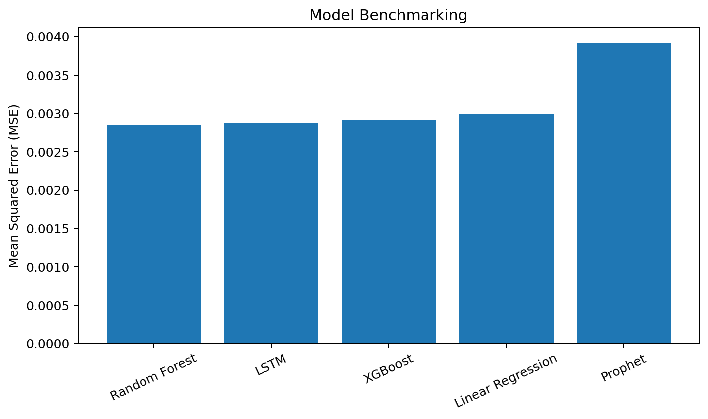
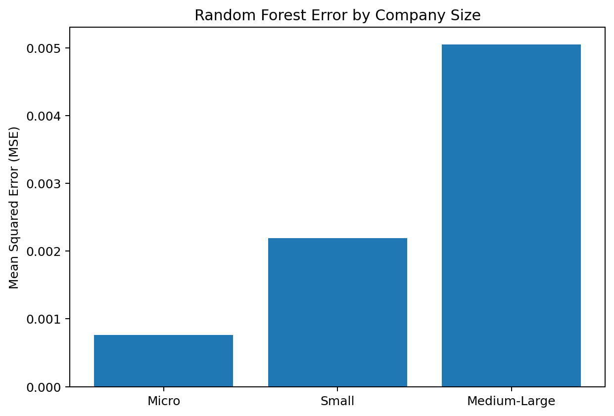
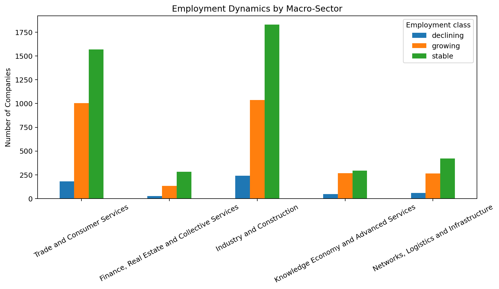

# Aggregate Results

This folder contains non-confidential aggregate outputs from the modelling
and business-analysis pipeline.

No company-level predictions, proprietary records or personally identifiable
information are included.

## Tables

- [`tables/model_comparison.csv`](tables/model_comparison.csv): benchmark MSE
  across Linear Regression, Random Forest, XGBoost, Prophet and LSTM.
- [`tables/error_by_firm_size.csv`](tables/error_by_firm_size.csv): Random
  Forest error across micro, small and medium-large companies.
- [`tables/employment_trends_by_sector.csv`](tables/employment_trends_by_sector.csv):
  employment-growth classes aggregated by economic macro-sector.

## Figures

### Model performance comparison

Random Forest achieved the lowest benchmark MSE (0.00285), closely followed
by LSTM (0.00287).

### Prediction error by company size

The reported error was lowest for micro companies and higher for small and
medium-large firms.

### Employment dynamics by macro-sector

The figure summarizes the distribution of declining, growing and stable firms
across the five macro-sectors used in the analysis.

## Economic–Sustainability Positioning

The project also combines predicted EBITDA and ESG performance in a
two-dimensional positioning matrix. Because the underlying company-level
predictions are confidential, the repository documents this analysis in the
research paper and in
[`05_explainability_and_business_insights.ipynb`](../notebooks/05_explainability_and_business_insights.ipynb)
rather than publishing company-level coordinates.
