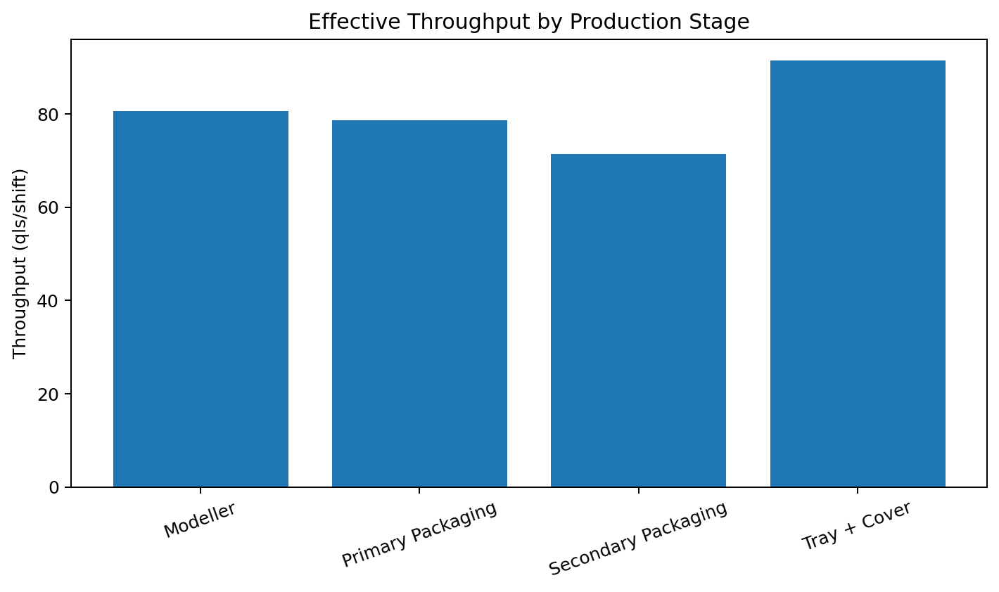
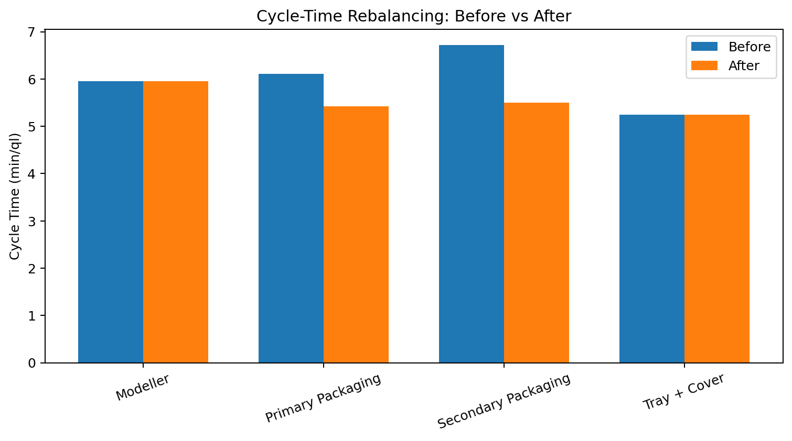
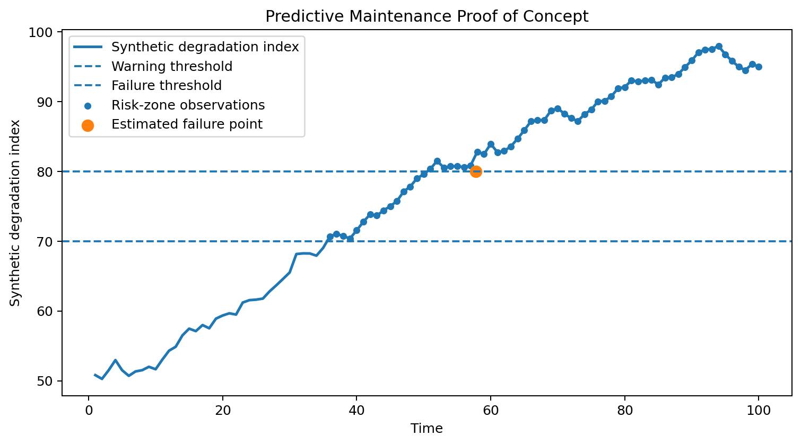

# Results

This folder contains non-confidential aggregate results and demonstrative
visualizations from the Ferrero Challengineers production-line project.

The figures reproduce the public analytical logic of the project using the
final assumption of **250 shifts/year**.

## 1. Bottleneck Diagnosis

Effective throughput before capacity expansion:

| Stage | Throughput |
|---|---:|
| Modeller | 80.64 qls/shift |
| Primary Packaging | 78.62 qls/shift |
| Secondary Packaging | **71.44 qls/shift** |
| Tray + Cover | 91.45 qls/shift |

Secondary Packaging has the lowest effective throughput and is therefore the
current bottleneck.

## 2. Line Rebalancing

The integer optimization adds:

- **1 Primary Packaging machine**
- **2 Secondary Packaging machines**

The resulting cycle-time comparison is:

| Stage | Before | After |
|---|---:|---:|
| Modeller | 5.95 | 5.95 |
| Primary Packaging | 6.11 | 5.43 |
| Secondary Packaging | 6.72 | 5.50 |
| Tray + Cover | 5.25 | 5.25 |

Values are expressed in minutes per quintal.

The intervention reduces the cycle-time imbalance at the packaging stages and
removes the original capacity shortfall against the annual production target.

## 3. Predictive Maintenance Prototype

The predictive-maintenance figure is a **demonstrative proof of concept**,
not a result obtained from real machine-condition data.

It illustrates the logic implemented in the public MATLAB prototype:

- simulate progressive equipment degradation;
- define a warning threshold;
- define a failure threshold;
- detect entry into the risk zone;
- fit a simple linear trend to estimate time to failure.

The original project roadmap proposed extending this logic with real
temperature, vibration, pressure and acoustic sensor data.

## Interpretation

The project combines three complementary decision layers:

1. **diagnose** the production constraint through throughput and cycle time;
2. **rebalance** capacity using integer optimization;
3. **anticipate** equipment deterioration through a predictive-maintenance
   proof of concept.

For implementation details, see:

- [`../matlab/01_bottleneck_capacity_analysis.m`](../matlab/01_bottleneck_capacity_analysis.m)
- [`../matlab/02_line_balancing_optimization.m`](../matlab/02_line_balancing_optimization.m)
- [`../matlab/03_predictive_maintenance_prototype.m`](../matlab/03_predictive_maintenance_prototype.m)
