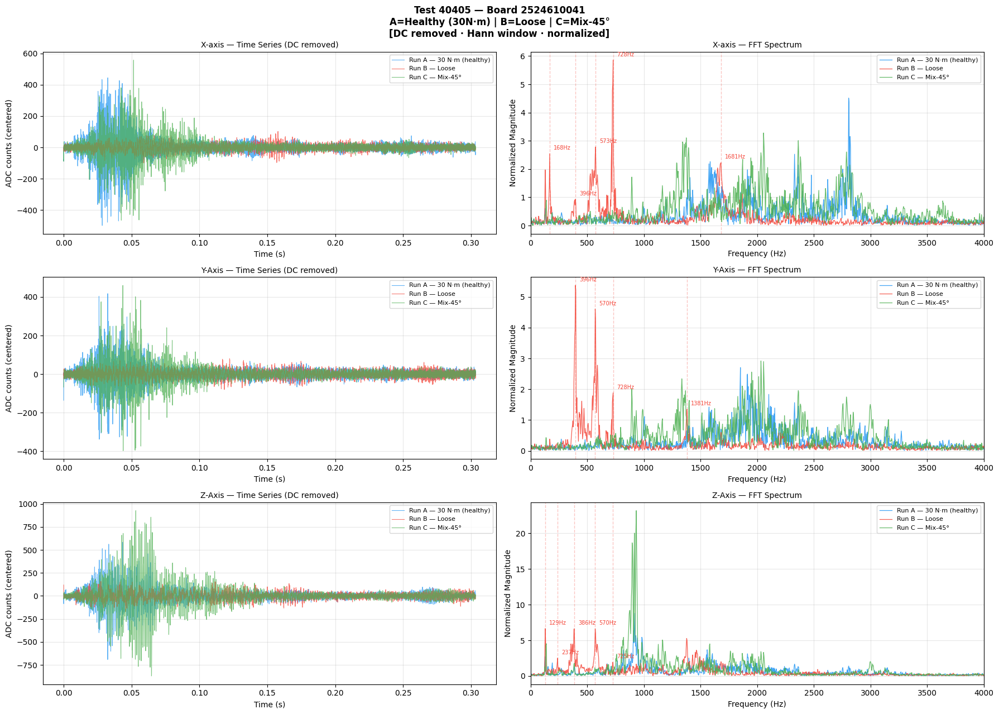
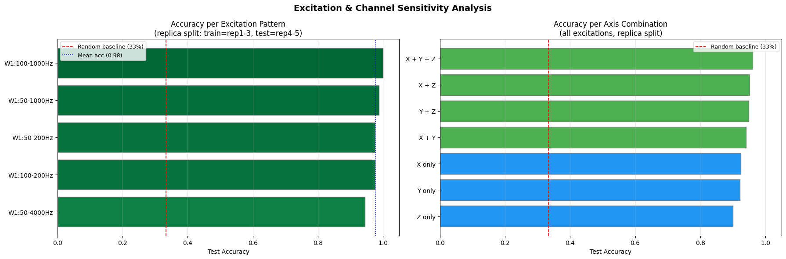
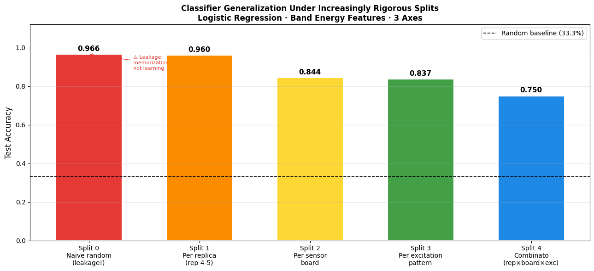
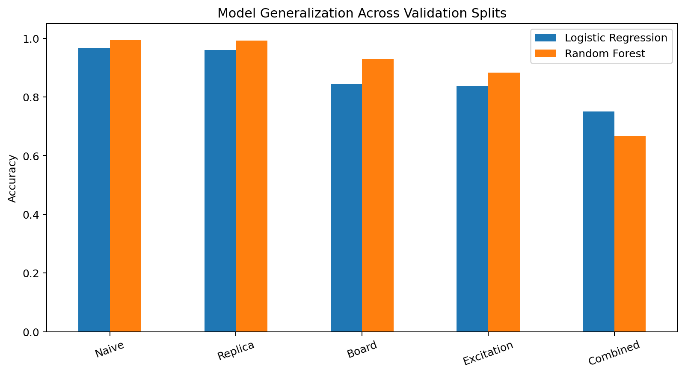
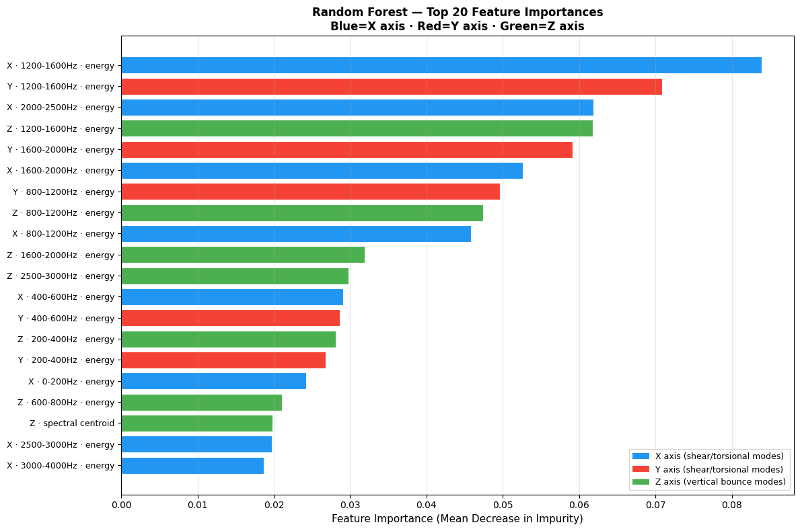

# Results

This folder contains the main non-confidential visual results from the GDG KU
Leuven vibration fault-detection project.

The figures come from the original Team 8 notebook or are reconstructed
directly from its reported metrics.

## 1. Corrected FFT Comparison



After mean subtraction, Hann windowing and spectral normalization, the loose
condition shows sharper resonance peaks across the three axes.

This is the physical basis for the spectral feature-engineering strategy.

## 2. Excitation and Channel Sensitivity



The most discriminative excitation is the **100–1000 Hz** pattern, while the
full three-axis feature set achieves the strongest channel result.

This provides both an engineering insight and a potential path toward a more
efficient production monitoring design.

## 3. Generalization Across Validation Splits



Performance decreases as overlap between training and test conditions is
removed.

Logistic Regression accuracy:

| Split | Accuracy |
|---|---:|
| Naive | 0.966 |
| Replica | 0.960 |
| Board | 0.844 |
| Excitation | 0.837 |
| Combined | 0.750 |

The gap between the naive and grouped splits demonstrates why validation
design is central to this project.

## 4. Logistic Regression vs Random Forest



Random Forest improves strongly on the unseen-board and unseen-excitation
splits, but Logistic Regression performs better on the small combined holdout.

The comparison supports model selection based on deployment conditions rather
than a single headline score.

## 5. Feature Importance



Random Forest assigns the strongest importance to spectral band-energy
features.

The model therefore independently confirms the physical interpretation
obtained from the FFT and sensitivity analyses.

## Additional Reported Results

On the replicate split:

```text
Random Forest accuracy = 0.9926
```

Class recall:

| Class | Recall |
|---|---:|
| 30NM | 1.00 |
| Loose | 1.00 |
| Mix-45° | 0.89 |

On the sensor-board holdout:

| Model | Accuracy |
|---|---:|
| Random Forest | **0.9304** |
| LightGBM | 0.8945 |
| RF + LightGBM | 0.9088 |

## Interpretation

The main result is not simply that the classifier performs well.

The project shows that:

1. the fault leaves a physically visible resonance signature;
2. feature engineering can encode that signature quantitatively;
3. grouped validation reveals the real limits of generalization;
4. hardware variability matters;
5. nonlinear models help under some forms of distribution shift;
6. additional model complexity is not automatically beneficial.
