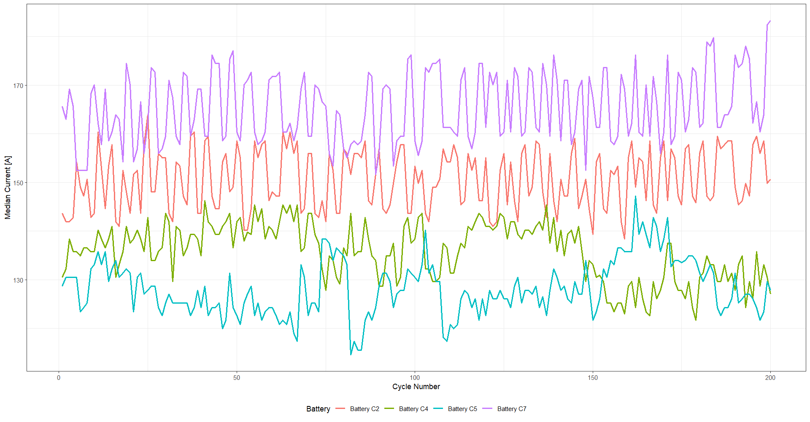
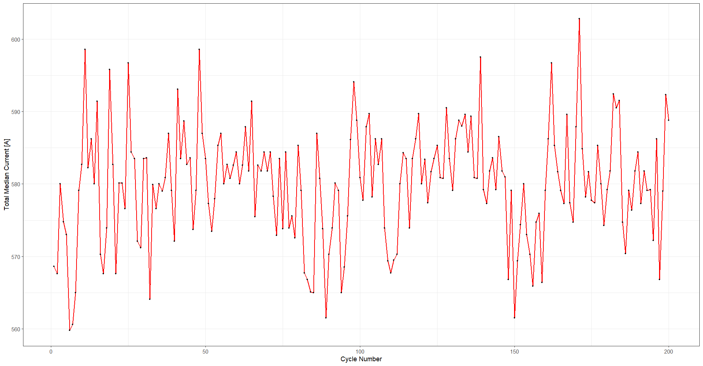
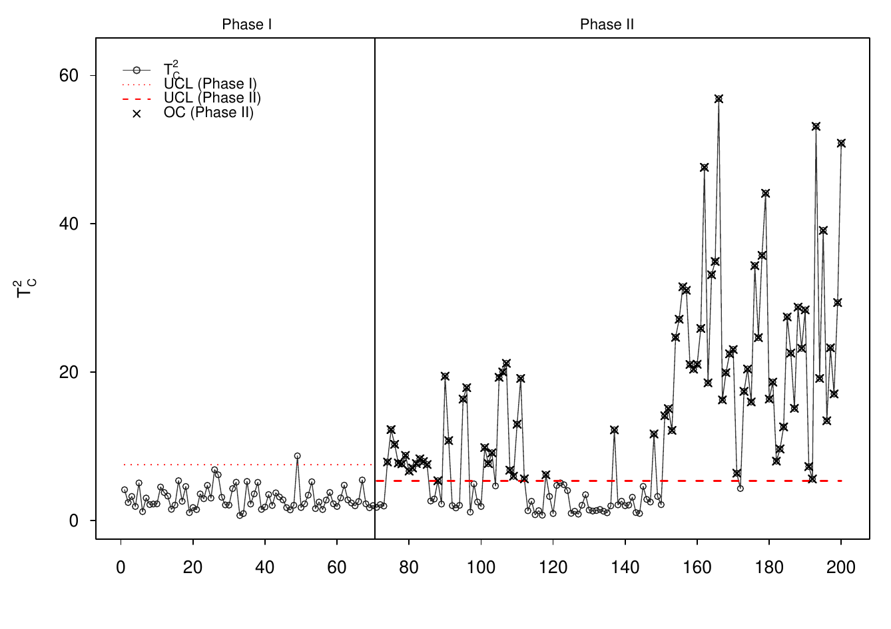
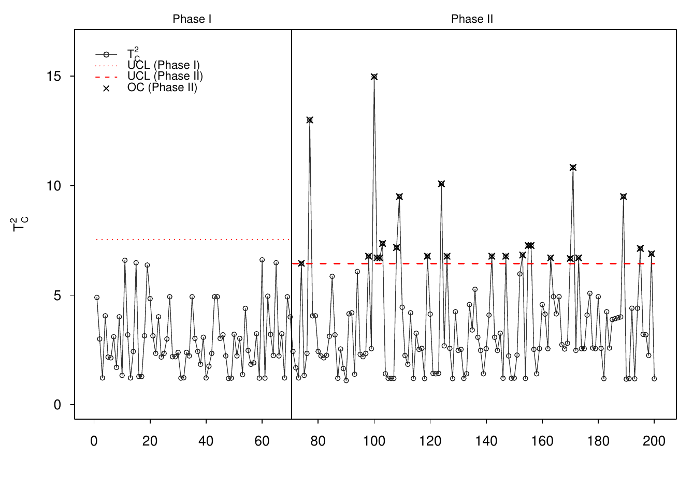

# Results

This folder contains the main non-confidential visual outputs from the Hitachi
Rail battery-monitoring project.

The figures are taken from the original project analysis and final
presentation. Raw industrial train-level data are not redistributed.

## 1. Median Current by Battery and Cycle

The cycle-level median currents show how the four parallel-connected batteries
share the discharge load over time.

The key pattern is not a uniform reduction in total current, but a
**redistribution of load across batteries**.

In the later part of the sequence, the project identifies a persistent pattern
in which:

- C4 and C5 reduce their current contribution;
- C2 and C7 compensate by carrying more of the load.

This component-level view is used to diagnose the multivariate control-chart
signals.

## 2. Total Median Current

The total median discharge current varies substantially from cycle to cycle,
reflecting changes in the external electrical load.

This plot motivates the compositional approach: monitoring absolute current
alone would mix changes in external demand with changes in internal battery
load sharing.

## 3. Compositional T² Control Chart

The main statistical monitoring output uses:

- a 70-cycle Phase I calibration window;
- compositional closure;
- ILR transformation;
- a Hotelling-type T² / Mahalanobis statistic;
- separate Phase I and Phase II control limits.

The final project interpretation highlights two regimes:

- approximately cycles **70–110**: a temporary abnormal regime;
- after approximately cycle **150**: a more persistent degradation /
  redistribution pattern.

Out-of-control points in Phase II are marked directly on the chart.

## 4. Voltage Sensitivity Analysis

Voltage is analysed as a complementary diagnostic because batteries connected
in parallel should operate at similar voltage levels.

The voltage chart also contains Phase II signals, but voltage is treated as a
secondary sensitivity analysis rather than the primary degradation indicator.

## Interpretation

The four figures together support the project’s central statistical argument:

1. the total load is variable;
2. absolute battery currents therefore contain a strong external-load effect;
3. relative current contributions reveal internal redistribution;
4. compositional multivariate monitoring detects departures from the reference
   load-sharing regime;
5. component-level current profiles help localize the batteries driving the
   signal.

The result is an interpretable early-warning framework rather than a
black-box failure classifier.

For implementation details, see:

- [`../R/01_cycle_level_feature_engineering.R`](../R/01_cycle_level_feature_engineering.R)
- [`../R/02_coda_t2_control_chart.R`](../R/02_coda_t2_control_chart.R)
- [`../R/03_voltage_sensitivity_analysis.R`](../R/03_voltage_sensitivity_analysis.R)
