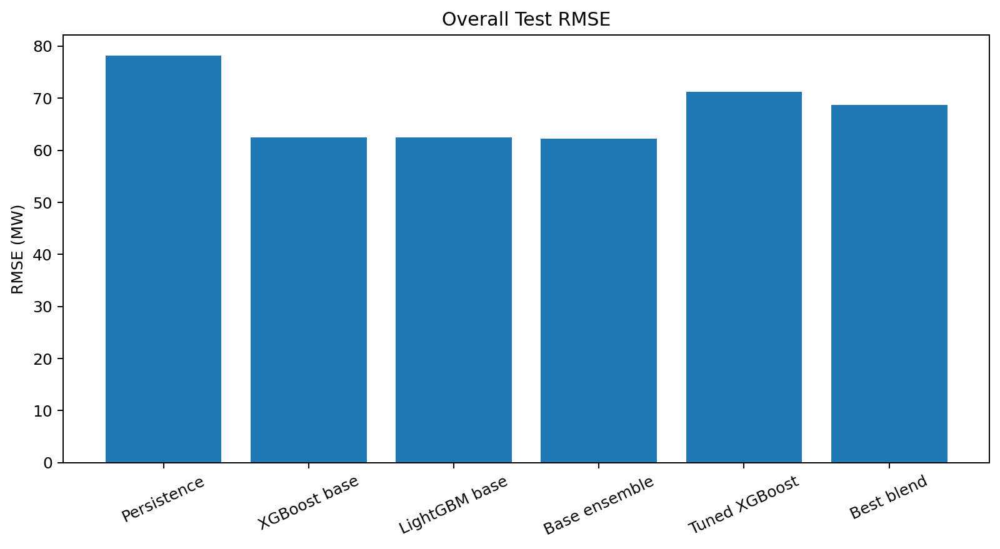
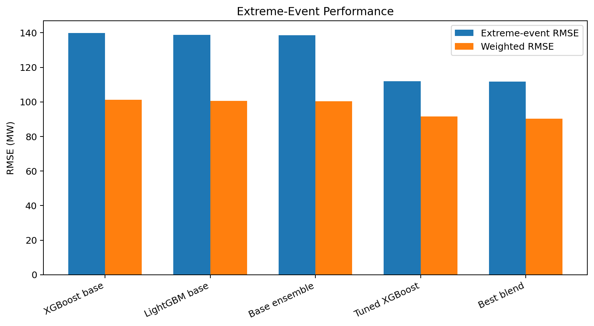
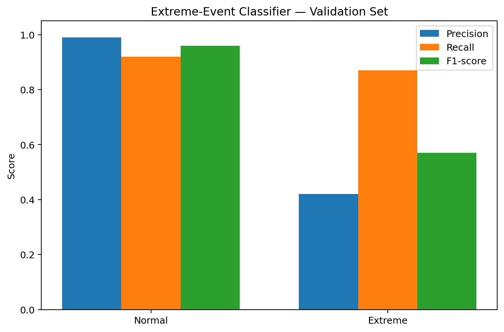

# Results

This folder contains non-confidential aggregate results from the ML6
Electricity Imbalance Forecasting project.

The original workshop datasets and leaderboard infrastructure are not
redistributed.

## 1. Overall Forecasting Performance



The persistence baseline reached a **78.24 MW** test RMSE.

The base tree-based models substantially improved average forecasting error:

| Model | Overall test RMSE |
|---|---:|
| Persistence | 78.24 MW |
| XGBoost base | 62.50 MW |
| LightGBM base | 62.49 MW |
| XGBoost + LightGBM ensemble | **62.27 MW** |

The base ensemble achieved the lowest overall RMSE among these benchmark
models.

## 2. Extreme-Event Performance



The workshop also evaluated performance on large imbalance events, defined as:

```text
|System Imbalance| > 300 MW
```

Because these events are economically important, the project used a weighted
metric:

```text
Weighted RMSE = 0.5 × Overall RMSE + 0.5 × Extreme-Event RMSE
```

| Model | Overall RMSE | Extreme RMSE | Weighted RMSE |
|---|---:|---:|---:|
| XGBoost base | 62.50 | 139.98 | 101.24 |
| LightGBM base | 62.49 | 138.88 | 100.68 |
| Base ensemble | 62.27 | 138.70 | 100.49 |
| Tuned reweighted XGBoost | 71.24 | 111.92 | 91.58 |
| Two-stage + tuned-XGBoost blend | 68.75 | **111.85** | **90.30** |

The extreme-event-focused models trade some average-error performance for
better behaviour on large imbalances.

## 3. Extreme-Event Classifier



The first stage of the two-stage model classifies whether the current
quarter-hour will become an extreme event.

On the validation set:

| Class | Precision | Recall | F1-score |
|---|---:|---:|---:|
| Normal | 0.99 | 0.92 | 0.96 |
| Extreme | 0.42 | **0.87** | 0.57 |

The high recall on extreme events was intentionally prioritized because
missing a large imbalance can be more costly than generating additional false
positives.

## Interpretation

There is no single best model under every objective:

- the **base ensemble** minimizes overall test RMSE;
- the **two-stage + tuned-XGBoost blend** achieves the best weighted RMSE and
  the lowest reported extreme-event RMSE among the compared final models.

This distinction reflects the workshop's central idea: electricity imbalance
forecasting should be evaluated not only through average prediction error, but
also through performance on high-impact system conditions.

For implementation details, see:

- [`../notebooks/01_core_imbalance_forecasting.ipynb`](../notebooks/01_core_imbalance_forecasting.ipynb)
- [`../notebooks/02_economic_simulation_and_battery_steering.ipynb`](../notebooks/02_economic_simulation_and_battery_steering.ipynb)
