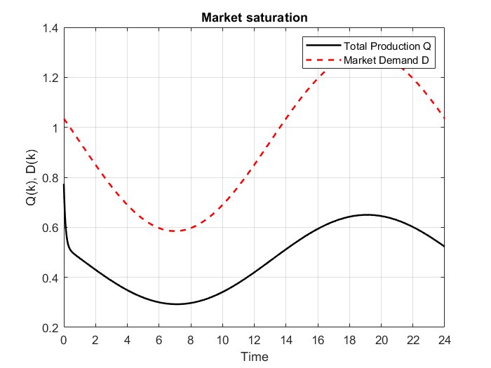
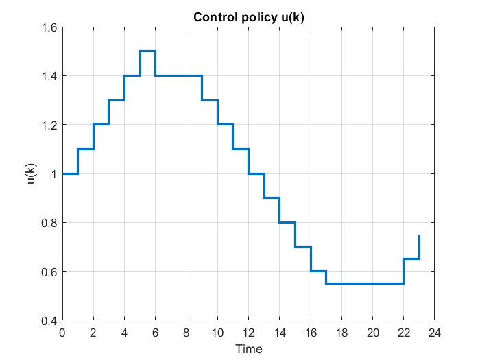
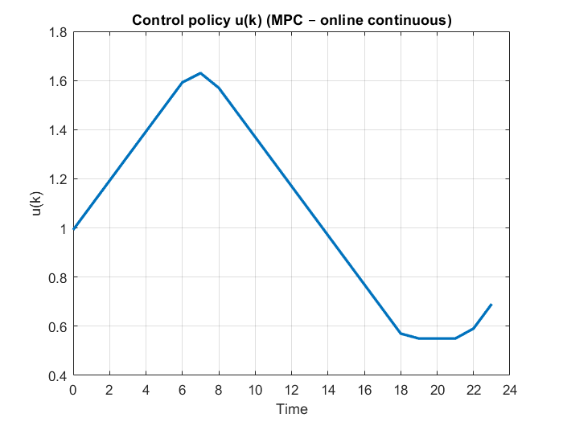
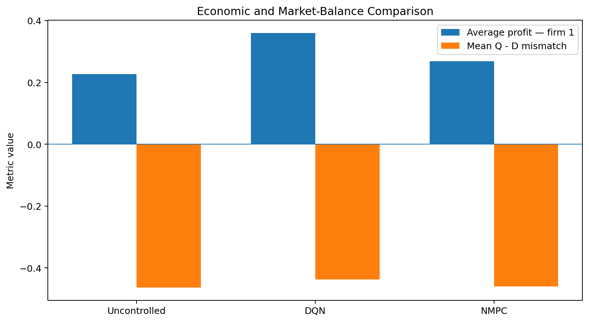

# Results

This folder contains the principal non-confidential visual results from the
dynamic-duopoly control project.

Three figures are exact plots extracted from the original project
presentation. The controller-comparison chart is reconstructed directly from
the numerical values reported in the final presentation.

## 1. Uncontrolled Dynamics



With a constant control:

```text
u = 1.0
```

total production remains below the time-varying demand trajectory for much of
the cycle.

Reported benchmark:

```text
mean firm-1 profit = 0.2272
mean Q-D mismatch = -0.4633
```

The baseline motivates active demand-responsive control.

## 2. DQN Control Policy



The learned DQN policy changes in discrete increments because the action space
is discretized.

The control is also rate-limited to prevent unrealistic changes between
successive steps.

The policy broadly responds to the demand cycle:

```text
high demand -> lower u
low demand  -> higher u
```

The original DQN results slide reports:

```text
mean profit = 0.3651
mean Q-D mismatch = -0.4382
```

The final DQN-vs-NMPC slide uses a nearby stochastic evaluation:

```text
mean profit = 0.3600
mean Q-D mismatch = -0.4377
```

The portfolio therefore treats DQN performance as approximate.

## 3. NMPC Control Policy



The NMPC policy is continuous and smooth while respecting the same box and
rate constraints.

Unlike the DQN, the action is obtained by solving a constrained nonlinear
optimization problem online at every step.

## 4. Controller Comparison



Final presentation values:

| Controller | Average profit — firm 1 | Mean Q-D mismatch |
|---|---:|---:|
| Uncontrolled | 0.2272 | -0.4633 |
| DQN | **0.3600** | **-0.4377** |
| NMPC | 0.2693 | -0.4594 |

Under the reported simulation configuration, the DQN achieves the highest
average firm-1 profit and the least negative mean mismatch.

This comparison is experiment-specific and should not be interpreted as a
general ranking of RL and MPC methods.

## Interpretation

Together, the results show three progressively stronger control strategies:

```text
constant control
-> learned demand-responsive policy
-> online nonlinear receding-horizon optimization
```

The main value of the experiment is the comparison between two different
decision paradigms on the same nonlinear economic system:

- policy learning from repeated interaction;
- explicit online optimization of future trajectories.
